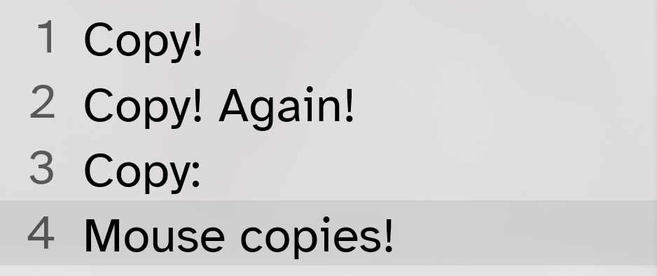

	
	

	
	

CopyFlyouts is a configurable Windows program meant to give visual and optionally audible feedback to copy operations, with the aim of avoiding situations in which a copy attempt has been made, and yet it is unclear whether the target was correctly copied.

## Disclaimer

While the main purpose and goal of CopyFlyouts is to be a genuinely useful program to improve the experience of copying things on Windows, it is still the summer project of a CS student with little real-life experience, and hence should be considered with the bad code that that can imply in mind.

## Getting started

Install the program via the [setup executable](https://github.com/krznck/CopyFlyouts/releases/latest/download/Setup_CopyFlyouts.exe), or download the [portable version](https://github.com/krznck/CopyFlyouts/releases/latest/download/CopyFlyouts_Portable.zip).

## Showcase

When the user presses Ctrl+C, a flyout appears, showing the contents currently attached to the clipboard.

If the item inside the clipboard is the same as before the copy attempt, an indicator will show that the clipboard was not updated.
By default, a failure sound will play when this happens.

There is also a special warning when the user copies whitespace, or there is nothing in the clipboard.

Flyouts can be displayed from copies not done through the keyboard, including copies not initiated by the user (like another program forcefully putting something into the clipboard).

CopyFlyouts works with files and images!

Both the appearance and behavior of CopyFlyouts is customizable via the settings.

Other useful features of CopyFlyouts are:

- light and dark color schemes
- ability to start minimized on system startup
- ability to minimize to the system tray
- portability to removable drives while retaining settings
- ability to show which process triggered a copy
